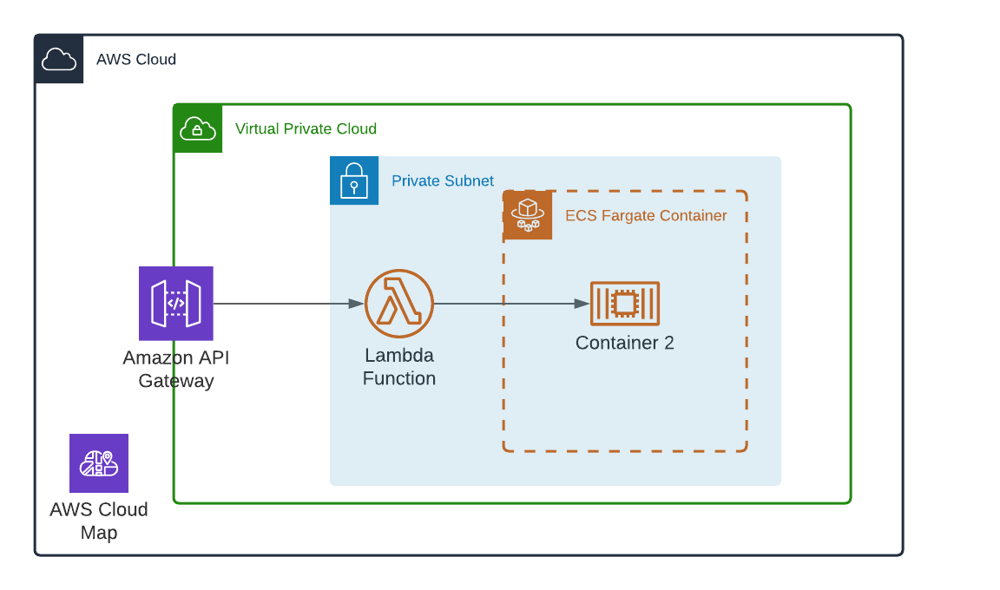

# A service discovery sample for Lambda and ECS architecture

## Architecture Diagram


## Install prequisite
```sh
$ yarn global add cdk
```

```sh
$ yarn
```

## Bootstrap and Deploy
```sh
$ cdk bootstrap
$ cdk -c namespace=whatevernamespace.local --outputs-file outputs.json deploy
```

## Test
```sh
$ curl -i $(cat outputs.json | jq -r ".\"lambda-ecs-stack-dev\".ApiEndpoint")
```

Expected respond
```
{"time":*unix epoch*}
```
